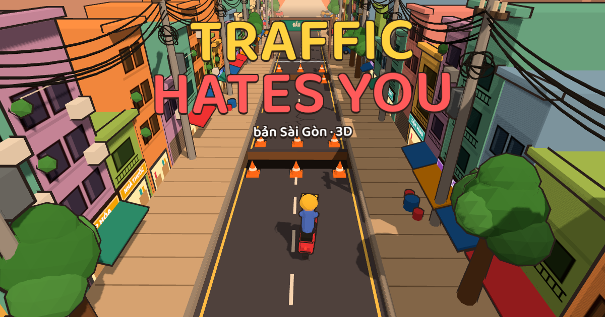

# Traffic Hates You – bản Sài Gòn 3D

Game troll-platformer 3D góc nhìn cao 3/4 cố định (học theo Trees Hate You): chạy xe máy tới công ty trước 8:00 qua 15 màn. Mỗi màn là một khu phố Sài Gòn nhỏ dựng như mô hình (hẻm, ngã tư, chợ, công viên, công trình...), đường đi quanh co có ngã rẽ, bạn tự do chạy 8 hướng và nhảy. Thứ gì trên đường cũng ghét bạn: ổ gà tàng hình, đèn đỏ troll, cột điện đổ, chó không xích, bà cụ qua đường, xe buýt, ô tô mở cửa, đinh tặc, cục nóng máy lạnh rơi, cây đổ, triều cường, cổng công ty tự đóng... Chết là chuyện bình thường, mỗi lần chết đồng hồ chạy thêm 1 phút.



## Nội dung

- **15 màn, 4 chương**: Hẻm Nhỏ (bình minh) · Đường Lớn (ban ngày) · Mưa Sài Gòn (mưa, đường trơn) · Tới Công Ty (Quận 1).
- **20 loại bẫy**, mỗi màn có 3–6 bẫy, chơi kiểu "chết một lần là nhớ".
- Đồ họa 3D kiểu hoạt hình (toon shading, viền đen), phố nhà ống, bảng hiệu, dây điện, mưa, nước ngập.
- Nhạc nền ngũ cung và hiệu ứng âm thanh đều được tổng hợp bằng Web Audio, không cần file âm thanh.
- Lưu tiến trình (màn đã mở, số lần chết ít nhất mỗi màn, kỷ lục cả lượt).
- Chơi được bằng bàn phím, cảm ứng (điện thoại, máy tính bảng) và tay cầm.
- Cài được như app (PWA) và chơi offline.
- Cài đặt: nhạc, âm thanh, rung, chất lượng đồ họa (Tự động/Cao/Vừa/Thấp), toàn màn hình, xóa tiến trình.

## Điều khiển

| Hành động | Bàn phím | Cảm ứng | Tay cầm |
|---|---|---|---|
| Chạy 8 hướng | ← ↑ → ↓ / W A S D | kéo cần gạt (càng kéo xa càng nhanh) | cần trái / D-pad |
| Nhảy | Space (hoặc J, K) | nút ⤒ bên phải | A |
| Chơi lại màn | R | menu tạm dừng | |
| Tạm dừng | Esc / P | ❚❚ | Start |

## Chạy trên máy

Cần Node.js 20 trở lên.

```bash
npm install
npm run dev        # mở http://localhost:5173/game.html
npm test           # bot tự chơi 15 màn, xác nhận màn nào cũng qua được
npm run build      # build vào dist/ và chép bản build ra thư mục gốc repo
npm run preview    # chạy thử bản build
```

## Phát hành

`npm run build` tạo thư mục `dist/` gồm toàn file tĩnh (HTML, JS, font, icon) và chép luôn ra thư mục gốc repo (`index.html`, `assets/`, `icons/`, `sw.js`...). Bản build dùng đường dẫn tương đối nên đặt ở thư mục nào cũng chạy. Mã nguồn trang nằm ở `game.html`; đừng sửa tay `index.html` ở gốc vì nó là file build.

### GitHub Pages (tự động)

Repo đang để Pages ở chế độ **Deploy from a branch** (`main` / root). Workflow `.github/workflows/deploy.yml` chạy mỗi lần push lên `main`: test, build rồi commit bản build vào thư mục gốc ("Update built game"); Pages tự đăng commit đó.

Link game: `https://betuanminh22032003.github.io/traffic-hates-you/`.

### itch.io

1. `npm run build`
2. Nén **nội dung** thư mục `dist` (không nén cả thư mục): `cd dist && zip -r ../traffic-hates-you.zip .`
3. Trên itch.io: Create new project → Kind of project: **HTML** → upload file zip → tick **This file will be played in the browser**.
4. Gợi ý cài đặt khung game: 1280 × 720, bật **Mobile friendly** (orientation: Landscape) và **Fullscreen button**.

### Netlify / Vercel / Cloudflare Pages

Kết nối repo, build command `npm run build`, publish directory `dist`. Không cần cấu hình thêm.

### Lên điện thoại như app

- Mở link game trên điện thoại → menu trình duyệt → **Thêm vào màn hình chính**. Game chạy toàn màn hình, nằm ngang, chơi được offline.
- Muốn lên Google Play: đóng gói PWA bằng [Bubblewrap](https://github.com/GoogleChromeLabs/bubblewrap) hoặc [PWABuilder](https://www.pwabuilder.com/) từ link đã đăng (cần HTTPS).

### Trước khi phát hành, kiểm tra

- [ ] `npm test` báo `All levels beatable.`
- [ ] `npm run build` không lỗi, `npm run preview` chơi thử được màn 1.
- [ ] Đổi link/ảnh chia sẻ nếu cần: thẻ `og:*` trong `game.html`, ảnh `public/icons/og.png`.
- [ ] Đổi phiên bản trong `package.json` và chữ `v1.0` ở màn hình tiêu đề (`game.html`).
- [ ] Đổi tên cache trong `public/sw.js` (`thy-v1` → `thy-v2`...) mỗi lần phát hành bản mới để người chơi cũ nhận bản mới ngay.

## Cấu trúc mã

```
game.html               khung trang + các màn hình menu (mã nguồn; index.html ở gốc là bản build)
src/main.js             vòng lặp game, luồng màn chơi, menu, input (phím, cảm ứng, tay cầm)
src/game/logic.js       mô phỏng gameplay thuần (không DOM, không three.js, tất định)
src/game/levels.js      dữ liệu 15 màn + 4 chương
src/game/messages.js    câu thoại khi chết
src/render/view.js      scene three.js, camera cao 3/4, người chơi, hạt, bong bóng thoại, cảnh báo xe ngoài màn hình
src/render/world.js     dựng khu phố từ bản đồ ô: đường, vỉa hè, cỏ, kênh, hố, nhà ống, bảng hiệu, trời, mưa
src/render/entities.js  hình 3D cho từng loại bẫy
src/render/models.js    mô hình (xe máy, chó, CSGT, bà cụ, xe buýt, ô tô, cây...)
src/render/toon.js      vật liệu toon, viền, chữ vẽ bằng canvas
src/audio.js            hiệu ứng âm thanh + nhạc nền tổng hợp
src/save.js             lưu tiến trình và cài đặt (localStorage)
scripts/smoke-test.mjs  bot tự chơi hết các màn (npm test)
scripts/solutions.mjs   "đường đi" của bot cho từng màn
scripts/make-icons.mjs  vẽ lại icon app (cần Playwright)
public/                 manifest PWA, service worker, icon
legacy-2d.html          bản prototype 2D ban đầu (không nằm trong bản build)
```

Logic dùng tọa độ "pixel": mỗi ô bản đồ rộng `T = 80`; `x` sang phải màn hình, `z` hướng về phía camera (xuống dưới màn hình), `h` là độ cao. Phần vẽ 3D dùng thẳng X = x, Y = h, Z = z. Camera đặt cao phía trước, nhìn xuống khoảng 58° và chỉ trượt theo người chơi trong giới hạn bản đồ. Vì logic tất định nên bot trong `scripts/` có thể phát lại một lời giải và chứng minh màn đó qua được.

## Thêm hoặc sửa màn

1. Mở `src/game/levels.js`, thêm một phần tử vào `LEVELS`: `id`, `ch` (chương), `name`, `rain` nếu trời mưa, `map` (mảng chuỗi, mỗi ký tự một ô) và `build` trả về danh sách bẫy.
2. Ký hiệu bản đồ:

   | Ký tự | Ô |
   |---|---|
   | `#` | nhà (tường, không đi qua được) |
   | `T` | cây · `K` sạp, ki-ốt (cũng là tường) |
   | `=` | lòng đường · `.` vỉa hè · `,` cỏ |
   | `~` | nước ngập (chạy chậm, ngâm lâu thì chết máy) |
   | ` ` (dấu cách) | kênh / hố (rơi là chết) |
   | `S` | chỗ xuất phát · `F` đích (ô sàn) |

3. Bẫy đặt theo tọa độ ô (cột, hàng), `0.5` là giữa ô. Hàm có sẵn: `hole` (ổ gà, `hidden` = tàng hình), `dog`, `mover` (car/bike/bus/cart/truck chạy thẳng theo hướng `R L U D`; `every` lặp lại, `aim` nhắm vào bạn, `stay` đỗ lại chắn đường, `roof` đứng lên nóc được), `pole`/`tree` (đổ theo góc `ang`), `fall` (máy lạnh, chậu kiểng, thép rơi đúng chỗ bạn đứng), `manhole`, `nails`, `light`, `speedcam`, `gate`, `walker` (bà cụ), `finish` (`run` = đích bỏ chạy), `sign` (đích giả), `plat` (thúng, giàn giáo; `mx/mz` di chuyển, `fall` sập), `banner`, `block`, `car` (ô tô đỗ, nhảy lên nóc được), `txt`. Tham số `at: [c, r]` và `tr` đặt điểm kích hoạt và bán kính.
4. Thêm lời giải cho bot vào `scripts/solutions.mjs` rồi chạy `npm test`. Gỡ lỗi một màn: `node scripts/dbg.mjs <id>` in ra từng sự kiện.

Số liệu vật lý tham khảo: tốc độ tối đa 4.4 px/khung (≈ 75 km/h trên đồng hồ), nhảy cao ≈ 84 px, nhảy xa ≈ 150 px (gần 2 ô) khi chạy hết tốc, nên hố rộng 1 ô nhảy qua được, hố 2 ô thì không; dây điện ở độ cao 250 px (bị nắp cống bắn lên là giật điện).

## Giấy phép tài nguyên

- Three.js: MIT. Font Baloo 2: SIL Open Font License (qua gói `@fontsource/baloo-2`).
- Toàn bộ mô hình, hình vẽ, âm thanh, nhạc trong game được tạo bằng mã trong repo này.
